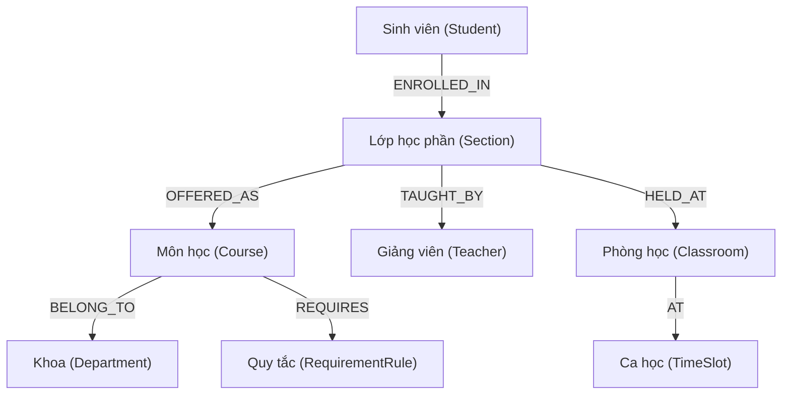

# UniGraph 🎓🕸️

**UniGraph** là một hệ thống xây dựng và khai thác **Knowledge Graph (Đồ thị tri thức)** dành cho dữ liệu đào tạo đại học. Dự án tập trung vào việc chuyển đổi dữ liệu thô từ các trang web đào tạo thành một mạng lưới tri thức có cấu trúc, cho phép thực hiện các truy vấn phức tạp và sẵn sàng cho các bài toán GraphRAG.

---

## 🧠 Mô hình Tri thức (The Knowledge Model)

Trái tim của UniGraph là một đồ thị tri thức với các thực thể liên kết chặt chẽ, cho phép mô hình hóa các quy tắc đào tạo phức tạp.

### Sơ đồ Thực thể (Entity Diagram)

### Các thực thể chính:
- **Course:** Thông tin môn học (Mã môn, số tín chỉ, tên Tiếng Việt/Anh).
- **RequirementRule:** Xử lý logic môn tiên quyết, song hành bằng cấu trúc cây logic (AND/OR).
- **Section & TimeSlot:** Quản lý thời khóa biểu và phân công giảng dạy.
- **Vector Index:** Tích hợp Vector Embedding trên Node `Course` để hỗ trợ tìm kiếm ngữ nghĩa.
